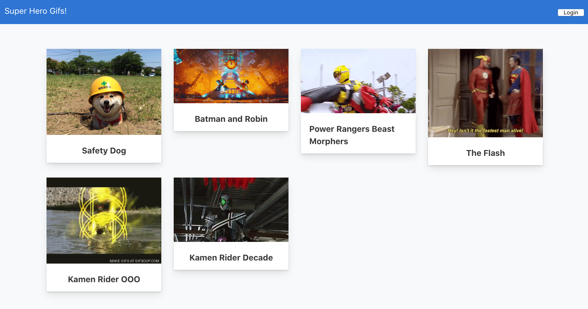

React-Contentful-Auth0 Super Hero Gif Collection
=====

An example knowledge base app made using [Contentful](https://www.contentful.com/), [Auth0](https://auth0.com/) and [React](https://reactjs.org/). Content lives in Contentful, authentication is handled by Auth0, styling is handled via [Bulma](https://bulma.io/) and that's all the services you need for this application. 



What is this about?
=====


Getting started
=====

### Requirements

To modify this project you'll need accounts for the following services:

- [Contentful](https://www.contentful.com)
- [Auth0](https://auth0.com/)


### Setup

* Fork and clone this repository
* On the command line, navigate to your cloned repo and install your dependencies with `yarn install`.

#### The Contentful part (optional)

This repo currently uses an existing Contentful space. If you'd like to replace this space with your own, so you can modify the content, you're welcome to do so.

* Create a new space using the [Contentful CLI](https://github.com/contentful/contentful-cli)

```console
$ contentful space create --name "superhero-gif-project"
? Do you want to confirm the space creation? Yes
Your user account is a member of multiple organizations. Please select the organization you would like to add your Space to.
? Please select an organization: Shy's DevRel Playground (orgid)
✨  Successfully created space superhero-gif-project (spaceID)
```
* Set the newly created space as default space for all further CLI operations. You'll be presented with a list of all available spaces – choose the one you just created.
```console
$ contentful space use
? Please select a space: superhero-gif-project (spaceID)
Now using the 'master' Environment of Space superhero-gif-project (spaceID) when the `--environment-id` option is missing.
```

* Import the provided content model (`./import/export.json`) into the newly created space.
```console
$ contentful space import --content-file import/export.json

```


#### The Auth0 part (optional)


#### Build the site

In the project directory, you can run `yarn start`. Runs the app in the development mode. Open [http://localhost:3000](http://localhost:3000) to view it in the browser. The page will reload if you make edits. You will also see any lint errors in the console.

You can learn more in the [Create React App documentation](https://facebook.github.io/create-react-app/docs/getting-started). To learn React, check out the [React documentation](https://reactjs.org/).

Implementation Notes
=======


License
=======
Code released under the MIT license. See [LICENSE](LICENSE) for further details.

